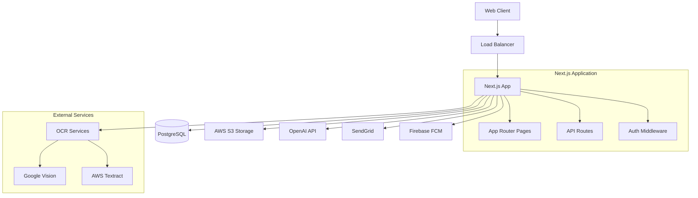

# ClaimFlow System Design Document

## Overview

ClaimFlow is a HIPAA-compliant Next.js 14+ application using the App Router architecture, TypeScript, and a comprehensive tech stack designed for secure healthcare data processing. The system combines OCR technology, AI-powered medical coding, and secure data handling to provide patients with a streamlined insurance claims management experience.

### Technology Stack

- **Frontend**: Next.js 14+ with App Router, React 18, TypeScript, Tailwind CSS
- **Backend**: Next.js API Routes, Prisma ORM, PostgreSQL
- **Authentication**: NextAuth.js with JWT tokens in httpOnly cookies
- **File Storage**: AWS S3 with signed URLs for secure file access
- **OCR Services**: Google Vision API and AWS Textract for document processing
- **AI Services**: OpenAI GPT-4 for medical coding suggestions, validation, and appeals
- **PDF Generation**: PDFKit for claim forms and appeal letters
- **Notifications**: Firebase Cloud Messaging (FCM) for push notifications, SendGrid for email
- **Security**: Column-level encryption, audit logging, HTTPS enforcement

## Architecture

### High-Level Architecture



### Application Structure

The application follows Next.js 14+ App Router conventions with clear separation of concerns:

```
/claimflow
├── /app                    # App Router pages and layouts
│   ├── /api               # API route handlers
│   ├── /dashboard         # Protected dashboard pages
│   ├── /auth              # Authentication pages
│   └── layout.tsx         # Root layout with providers
├── /components            # Reusable React components
├── /lib                   # Utility libraries and services
├── /types                 # TypeScript type definitions
├── /utils                 # Helper functions and validators
└── /prisma               # Database schema and migrations
```

## Components and Interfaces

### Core Components

#### Authentication Components
- **AuthForm.tsx**: Unified login/registration form with validation
- **AuthProvider.tsx**: Context provider for authentication state
- **ProtectedRoute.tsx**: HOC for route protection

#### Insurance Management Components
- **InsuranceOCR.tsx**: Camera/upload interface with OCR processing
- **InsuranceForm.tsx**: Manual entry form with validation
- **InsuranceCard.tsx**: Display component for saved insurance profiles

#### Claims Management Components
- **ClaimForm.tsx**: Multi-step claim creation form
- **ClaimCard.tsx**: Dashboard card showing claim summary and status
- **ClaimDetails.tsx**: Detailed view with timeline and documents
- **ReceiptUpload.tsx**: Drag-and-drop receipt upload with preview

#### AI-Powered Components
- **SuperbillAssistant.tsx**: AI code suggestion interface with confidence scores
- **ValidationPanel.tsx**: Real-time claim validation with error/warning display
- **AppealGenerator.tsx**: AI appeal letter generation and editing interface

#### Notification Components
- **NotificationBanner.tsx**: In-app notification display
- **NotificationCenter.tsx**: Notification history and preferences

### Service Interfaces

#### OCR Service Interface
```typescript
interface OCRService {
  parseInsuranceCard(file: File): Promise<InsuranceProfilePartial>;
  parseReceipt(file: File): Promise<ReceiptData>;
  extractText(file: File): Promise<string>;
}
```

#### AI Service Interface
```typescript
interface AIService {
  suggestCodes(context: ClaimContext): Promise<CodeSuggestion[]>;
  validateClaim(claim: Claim): Promise<ValidationResult>;
  generateAppeal(claim: Claim, denialReason: string): Promise<string>;
}
```

#### PDF Service Interface
```typescript
interface PDFService {
  generateClaimPDF(claim: Claim): Promise<string>;
  generateAppealPDF(claim: Claim, appealText: string): Promise<string>;
}
```

## Data Models

### Database Schema (Prisma)

#### User Model
```typescript
model User {
  id           String   @id @default(cuid())
  email        String   @unique
  passwordHash String   // Encrypted
  name         String?
  dob          DateTime?
  phone        String?  // Encrypted
  address      String?  // Encrypted
  insurance    InsuranceProfile?
  claims       Claim[]
  notifications Notification[]
  auditLogs    AuditLog[]
  createdAt    DateTime @default(now())
  updatedAt    DateTime @updatedAt
}
```

#### Insurance Profile Model
```typescript
model InsuranceProfile {
  id         String @id @default(cuid())
  user       User   @relation(fields: [userId], references: [id])
  userId     String @unique
  insurer    String // Encrypted
  plan       String? // Encrypted
  memberId   String // Encrypted
  groupId    String? // Encrypted
  payerId    String? // Encrypted
  address    String? // Encrypted
  cardImageUrl String? // S3 signed URL
  createdAt  DateTime @default(now())
  updatedAt  DateTime @updatedAt
}
```

#### Claim Model
```typescript
model Claim {
  id              String   @id @default(cuid())
  user            User     @relation(fields: [userId], references: [id])
  userId          String
  providerName    String? // Encrypted
  providerNpi     String?
  dateOfService   DateTime?
  amountCents     Int
  cptCodes        String[] // Medical procedure codes
  icdCodes        String[] // Diagnosis codes
  status          ClaimStatus
  submissionMethod SubmissionMethod
  denialReason    String?
  paidAmountCents Int?
  confidenceScore Float?
  timeline        Json // Status change history
  receiptUrls     String[] // S3 signed URLs
  documents       ClaimDocument[]
  validationResults Json?
  createdAt       DateTime @default(now())
  updatedAt       DateTime @updatedAt
}
```

#### Supporting Models
```typescript
model ClaimDocument {
  id       String @id @default(cuid())
  claim    Claim  @relation(fields: [claimId], references: [id])
  claimId  String
  type     DocumentType
  url      String // S3 signed URL
  filename String
  createdAt DateTime @default(now())
}

model Notification {
  id        String @id @default(cuid())
  user      User   @relation(fields: [userId], references: [id])
  userId    String
  type      NotificationType
  title     String
  message   String
  read      Boolean @default(false)
  data      Json?
  createdAt DateTime @default(now())
}

model AuditLog {
  id        String @id @default(cuid())
  user      User?  @relation(fields: [userId], references: [id])
  userId    String?
  action    String
  resource  String
  details   Json
  ipAddress String
  userAgent String
  createdAt DateTime @default(now())
}
```

### TypeScript Enums and Types

```typescript
enum ClaimStatus {
  DRAFT = 'draft',
  VALIDATING = 'validating',
  READY = 'ready',
  SUBMITTED = 'submitted',
  PROCESSING = 'processing',
  PAID = 'paid',
  DENIED = 'denied',
  APPEALED = 'appealed'
}

enum SubmissionMethod {
  ELECTRONIC = 'electronic',
  PDF = 'pdf'
}

enum DocumentType {
  RECEIPT = 'receipt',
  INSURANCE_CARD = 'insurance_card',
  CLAIM_FORM = 'claim_form',
  APPEAL_LETTER = 'appeal_letter'
}

enum NotificationType {
  CLAIM_STATUS_CHANGE = 'claim_status_change',
  VALIDATION_COMPLETE = 'validation_complete',
  SUBMISSION_COMPLETE = 'submission_complete',
  PAYMENT_RECEIVED = 'payment_received'
}
```

## Error Handling

### Error Classification
- **Validation Errors**: Client-side and server-side input validation
- **Authentication Errors**: Login failures, session expiration
- **OCR Errors**: Image processing failures, unreadable documents
- **AI Service Errors**: API rate limits, service unavailability
- **File Upload Errors**: Size limits, format restrictions
- **Database Errors**: Connection issues, constraint violations
- **External API Errors**: Insurance clearinghouse, notification services

### Error Response Format
```typescript
interface APIError {
  code: string;
  message: string;
  details?: Record<string, any>;
  timestamp: string;
  requestId: string;
}
```

### Error Handling Strategy
- **Client-side**: React Error Boundaries with fallback UI
- **API Routes**: Centralized error middleware with logging
- **Database**: Transaction rollbacks and retry logic
- **External Services**: Circuit breaker pattern with fallbacks
- **User Experience**: Progressive disclosure of error details

## Testing Strategy

### Unit Testing
- **Components**: React Testing Library for component behavior
- **Services**: Jest for business logic and API integrations
- **Utilities**: Pure function testing with edge cases
- **Database**: Prisma client mocking and integration tests

### Integration Testing
- **API Routes**: Supertest for endpoint testing
- **OCR Pipeline**: Mock external services with test images
- **AI Services**: Deterministic responses for consistent testing
- **File Upload**: S3 mock with various file types and sizes

### End-to-End Testing
- **User Flows**: Playwright for complete user journeys
- **Cross-browser**: Chrome, Firefox, Safari compatibility
- **Mobile**: Responsive design and touch interactions
- **Accessibility**: WCAG 2.1 compliance testing

### Security Testing
- **Authentication**: JWT token validation and expiration
- **Authorization**: Role-based access control
- **Data Encryption**: Verify encryption at rest and in transit
- **HIPAA Compliance**: PHI handling and audit trail verification

### Performance Testing
- **Load Testing**: Concurrent user simulation
- **OCR Performance**: Large file processing benchmarks
- **Database Queries**: Query optimization and indexing
- **CDN Integration**: Static asset delivery optimization

## Security Implementation

### HIPAA Compliance Measures

#### Data Encryption
- **At Rest**: PostgreSQL column-level encryption for PHI
- **In Transit**: TLS 1.3 for all communications
- **File Storage**: S3 server-side encryption with customer-managed keys
- **Application**: AES-256 encryption for sensitive fields

#### Access Controls
- **Authentication**: Multi-factor authentication support
- **Authorization**: Row-level security for user data isolation
- **API Security**: Rate limiting and request validation
- **Session Management**: Secure JWT tokens with short expiration

#### Audit and Monitoring
- **Audit Logs**: Comprehensive logging of all PHI access
- **Monitoring**: Real-time security event detection
- **Compliance Reporting**: Automated HIPAA compliance reports
- **Incident Response**: Automated breach detection and notification

### Security Headers and Middleware
```typescript
// Security middleware configuration
const securityHeaders = {
  'Strict-Transport-Security': 'max-age=31536000; includeSubDomains',
  'X-Content-Type-Options': 'nosniff',
  'X-Frame-Options': 'DENY',
  'X-XSS-Protection': '1; mode=block',
  'Content-Security-Policy': "default-src 'self'; script-src 'self' 'unsafe-inline'",
  'Referrer-Policy': 'strict-origin-when-cross-origin'
};
```

## Performance Optimization

### Frontend Optimization
- **Code Splitting**: Dynamic imports for route-based splitting
- **Image Optimization**: Next.js Image component with WebP support
- **Caching**: Service worker for offline functionality
- **Bundle Analysis**: Webpack bundle analyzer for size optimization

### Backend Optimization
- **Database Indexing**: Optimized queries with proper indexes
- **Connection Pooling**: Prisma connection pool configuration
- **Caching**: Redis for session and frequently accessed data
- **API Rate Limiting**: Prevent abuse and ensure fair usage

### File Processing Optimization
- **Image Compression**: Client-side compression before upload
- **Parallel Processing**: Concurrent OCR processing for multiple files
- **Background Jobs**: Queue system for time-intensive operations
- **CDN Integration**: CloudFront for global file delivery

## Deployment and Infrastructure

### Environment Configuration
- **Development**: Local PostgreSQL and S3 LocalStack
- **Staging**: AWS RDS and S3 with reduced resources
- **Production**: Multi-AZ RDS, S3 with CloudFront, ECS/Fargate

### CI/CD Pipeline
- **Testing**: Automated test suite on pull requests
- **Security Scanning**: SAST/DAST tools in pipeline
- **Database Migrations**: Automated Prisma migrations
- **Deployment**: Blue-green deployment with health checks

### Monitoring and Observability
- **Application Monitoring**: New Relic or DataDog integration
- **Error Tracking**: Sentry for error aggregation and alerting
- **Performance Metrics**: Core Web Vitals and custom metrics
- **Health Checks**: Endpoint monitoring and alerting